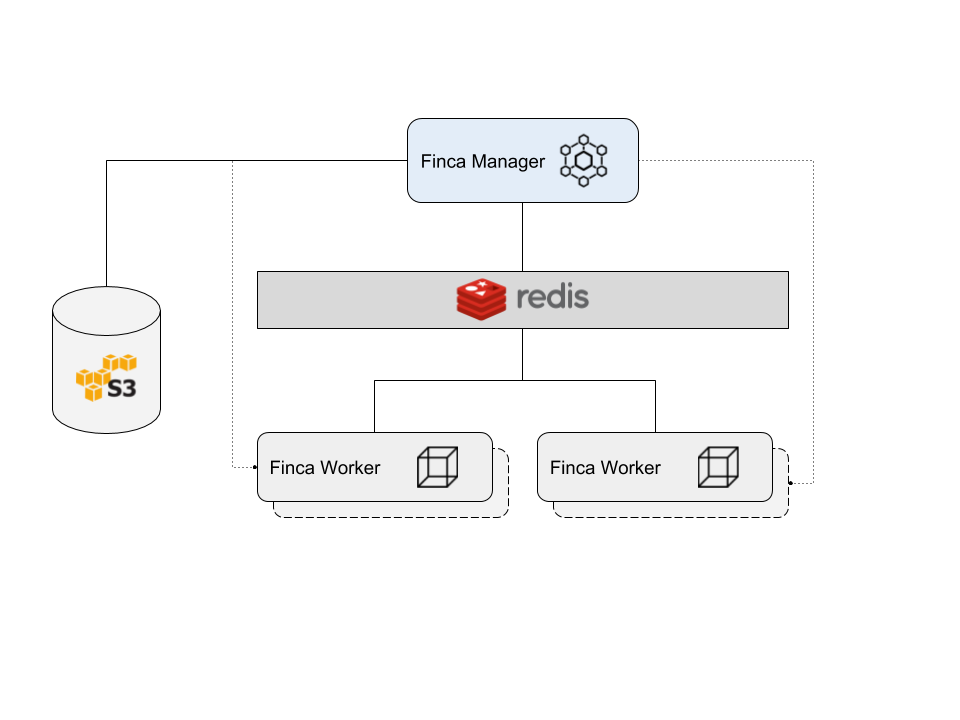

```
 ________ ___  ________   ________  ________
|\  _____\\  \|\   ___  \|\   ____\|\   __  \
\ \  \__/\ \  \ \  \\ \  \ \  \___|\ \  \|\  \
 \ \   __\\ \  \ \  \\ \  \ \  \    \ \   __  \
  \ \  \_| \ \  \ \  \\ \  \ \  \____\ \  \ \  \
   \ \__\   \ \__\ \__\\ \__\ \_______\ \__\ \__\
    \|__|    \|__|\|__| \|__|\|_______|\|__|\|__|

```

Finca is a render farm system.

Finca provides a manager + worker distributed rendering system.  Currently
LuxRender is the only supported render engine but the intent is to allow
for several (LuxRender, cycles, RenderMan, Maxwell, Mitsuba, Octane, etc).

# Design
Finca uses Redis for worker health and pub/sub communication and S3 for job
configuration and result storage.  By default, the stack deploys [Minio](https://www.minio.io/)
as the S3 compatible storage engine for local storage but you can configure
AWS S3 as well.



# Usage
There are two modes of operation in the Finca executable: manager and agent.  Manager
runs the job manager that exposes an API and manages the job storage, retrieval and
processing.  The agent manages the local render engine to prepare for processing.
See the `docker-stack.yml` stack file for service details.

# API
The Finca manager exposes a simple RESTful API for job processing.  The following
endpoints are available:

| Endpoint | Method | Description |
|----------|--------|-------------|
| `/jobs/new` | POST | Queue a new job.  Form field must be `file`. |
| `/jobs/cancel` | POST | Cancel current running job.  This also signals the workers to cancel processing. |
| `/workers` | GET | Returns list of available workers. |

# Jobs
Jobs are archives of the LuxRender scene and supporting files.  For example, to create a new
Finca job from Blender, use the LuxBlend exporter.  If your project is named `demo` there will
be a `demo.lxs` and a directory named `demo` in the output directory.  Zip both of those and
that is the archive that is sent to the Finca manager via the API.  For example, to send
a project named `demo.zip`:

```
$> curl -F "file=@demo.zip" finca-manager:8080/jobs/new
job demo.zip queued
```

You can then monitor the render process by checking the service logs:

```
$> docker service logs -f finca_manager
```

The Finca manager will peroidically upload the render progress to S3.  There is also
a sample project in the [samples](./docs/samples/) directory that you can use to
verify the system is working properly.

# Deploy
To deploy Finca, use the Docker stack file.  This assumes you have a recent working Docker engine
and it is in [Swarm mode](https://docs.docker.com/engine/swarm/).  Once you are ready you
can deploy:

First create the config and secrets:

```
$> echo "dir /data" | docker config create redis.conf -
$> echo "ACCESSKEYHERE" | docker secret create finca_access_key -
$> echo "SUPERSECRETKEYHERE" | docker secret create finca_secret_key -
```

Now you can deploy Finca:

```
$> docker stack deploy -c docker-stack.yml finca

```
